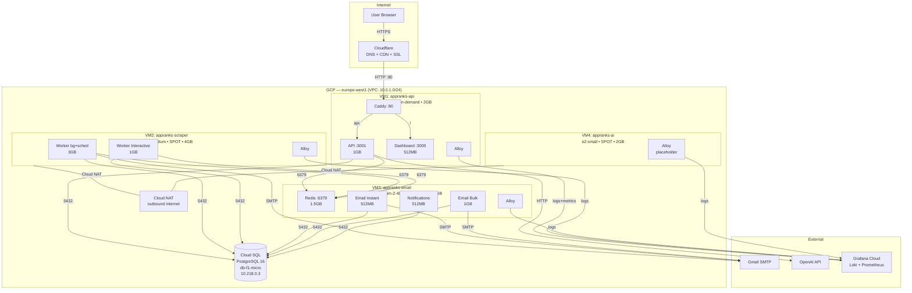
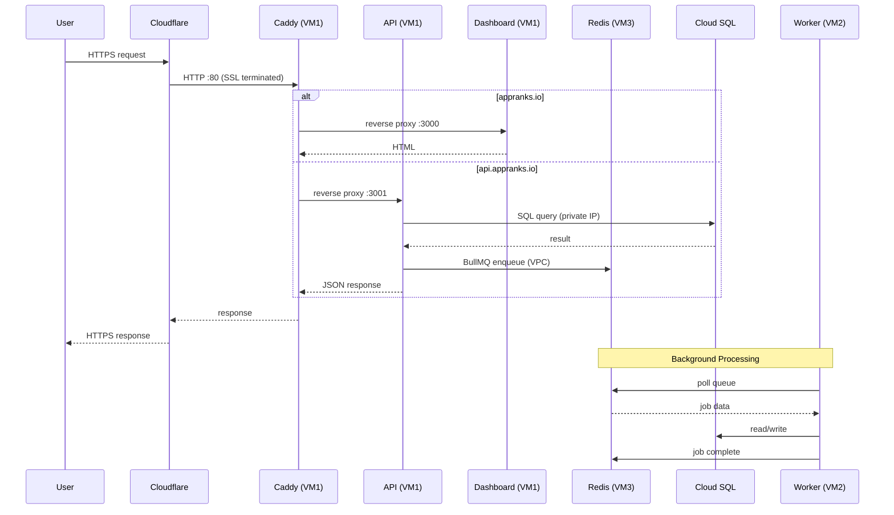
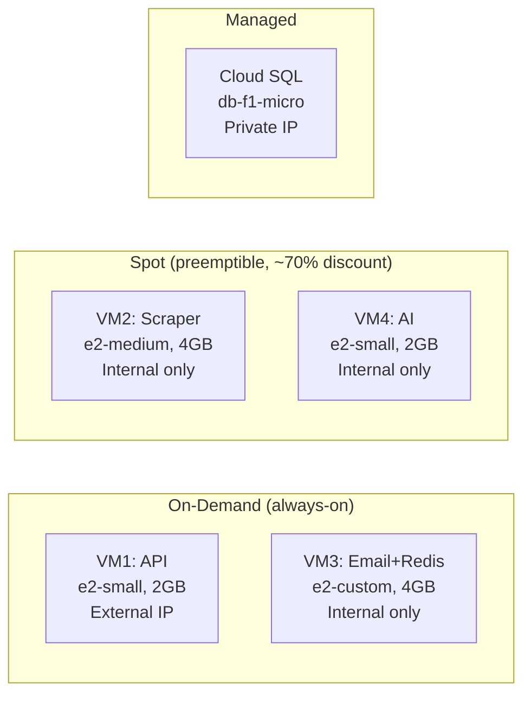
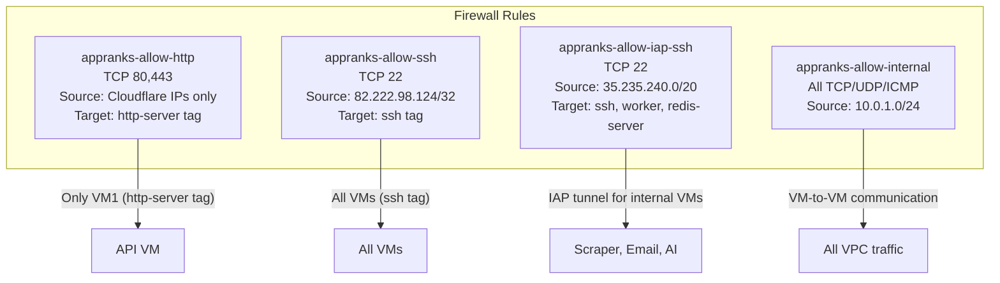
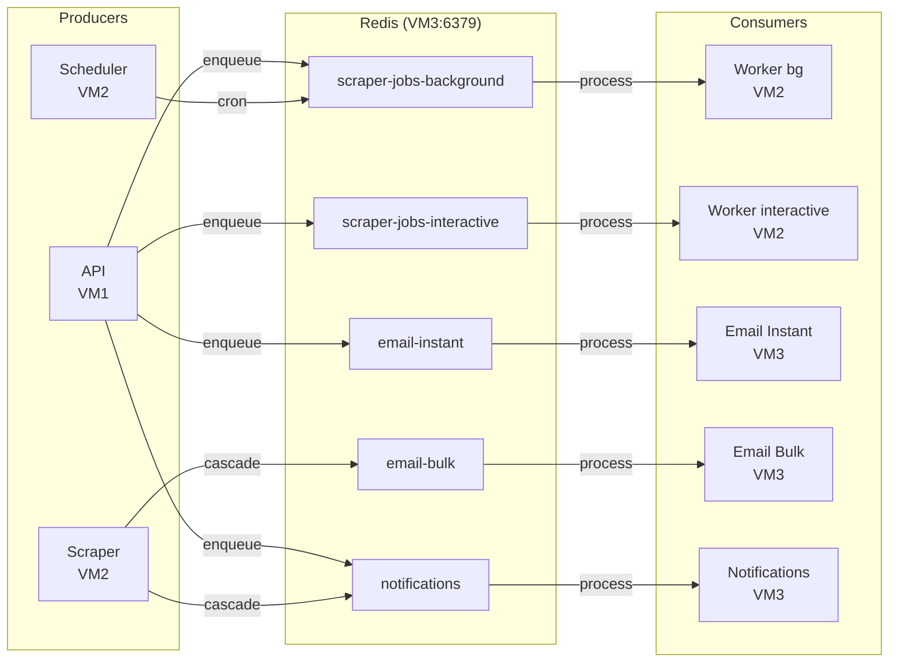
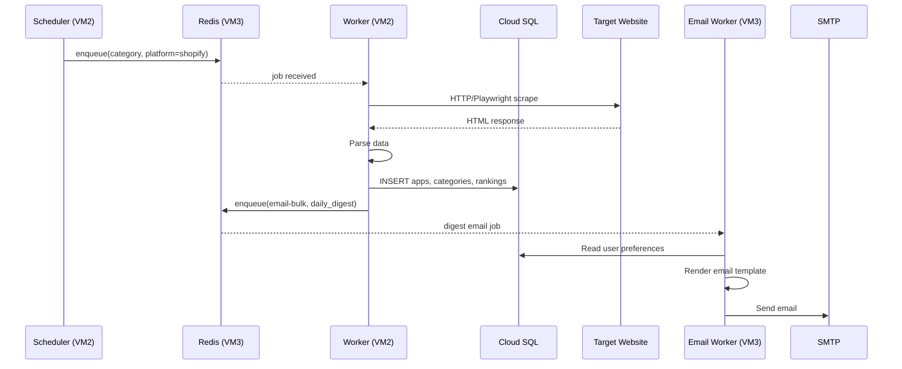
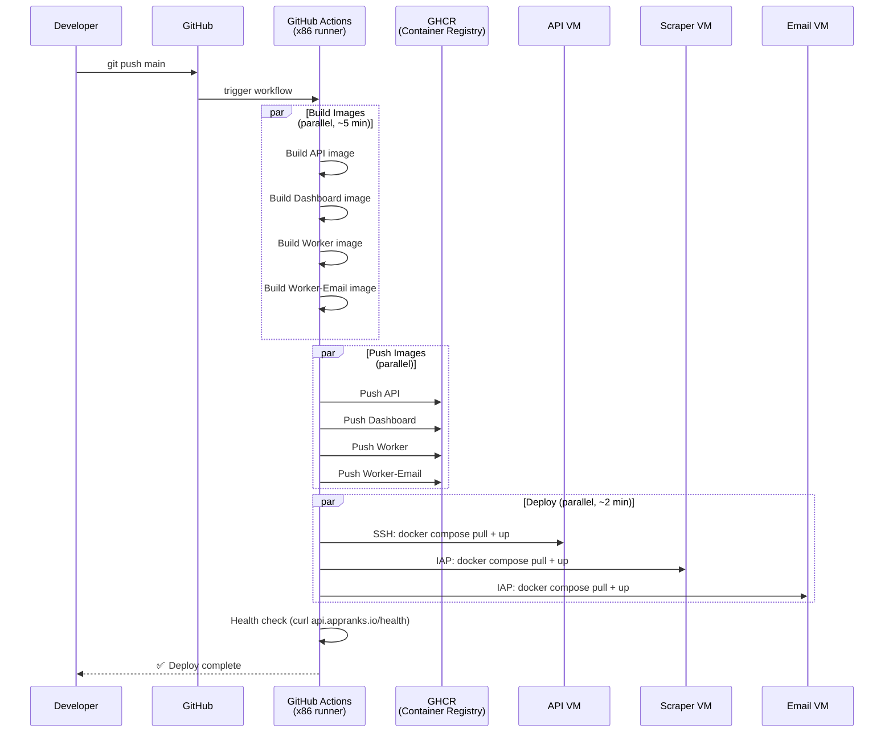
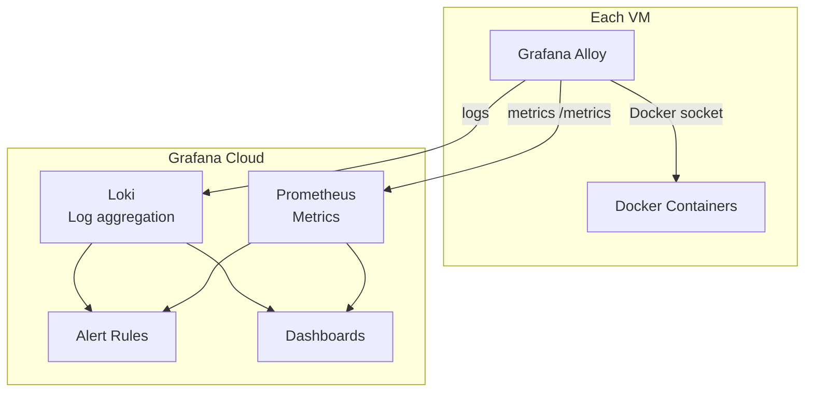
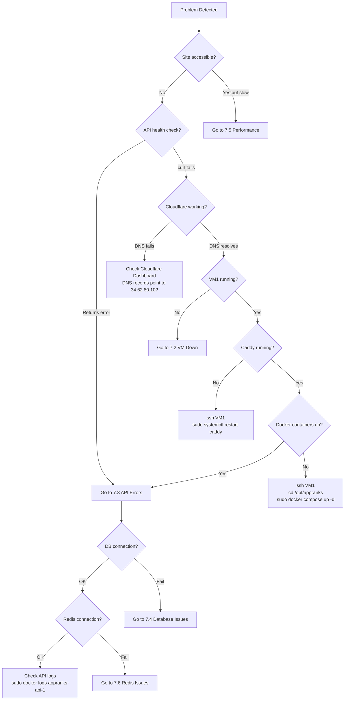

# AppRanks — System Architecture (GCP Tier 7 Light)

**Last updated:** 2026-04-05
**Environment:** Production
**Platform:** Google Cloud Platform (europe-west1)
**Project ID:** `appranks-web-app`

---

## Quick Reference

| Resource | Value |
|----------|-------|
| **Dashboard** | https://appranks.io |
| **API** | https://api.appranks.io |
| **API Health** | https://api.appranks.io/health |
| **API VM IP** | `34.62.80.10` |
| **DB Private IP** | `10.218.0.3` |
| **Redis (Email VM)** | `10.0.1.5:6379` |
| **Scraper VM** | `10.0.1.3` (internal) |
| **AI VM** | `10.0.1.2` (internal) |
| **GCP Console** | https://console.cloud.google.com/compute/instances?project=appranks-web-app |
| **SSH (API)** | `ssh -i ~/.ssh/appranks-gcp deploy@34.62.80.10` |
| **SSH (others)** | `gcloud compute ssh deploy@appranks-<vm> --zone=europe-west1-b --tunnel-through-iap` |

---

## 1. Architecture Overview

### 1.1 High-Level Topology



### 1.2 Network Flow



### 1.3 VM Summary



---

## 2. Infrastructure Deep Dive

### 2.1 VM Configurations

| VM | Name | Machine | RAM | Disk | Pricing | IP | Containers |
|----|------|---------|-----|------|---------|-----|------------|
| VM1 | `appranks-api` | e2-small | 2GB | 20GB pd-balanced | On-demand | `34.62.80.10` (static) | API, Dashboard, Caddy, Alloy |
| VM2 | `appranks-scraper` | e2-medium | 4GB | 20GB pd-balanced | **Spot** | `10.0.1.3` (internal) | Worker, Worker-Interactive, Alloy |
| VM3 | `appranks-email` | e2-custom-2-4096 | 4GB | 20GB pd-balanced | On-demand | `10.0.1.5` (internal) | Redis, Email-Instant, Email-Bulk, Notifications, Alloy |
| VM4 | `appranks-ai` | e2-small | 2GB | 10GB pd-balanced | **Spot** | `10.0.1.2` (internal) | Alloy (AI workers placeholder) |

### 2.2 Container Memory Map

```
VM1: API (2GB total)
├── API               1024MB
├── Dashboard          512MB
├── Alloy              256MB
└── Caddy          (systemd, ~50MB)
    Available headroom: ~200MB

VM2: Scraper (4GB total)
├── Worker            3072MB  (Playwright + 11 platforms)
├── Worker-Interactive 1024MB
└── Alloy              256MB
    Available headroom: ~0MB ⚠️ tight

VM3: Email+Redis (4GB total)
├── Redis             1536MB  (AOF persistence)
├── Email-Instant      512MB
├── Email-Bulk        1024MB
├── Notifications      512MB
└── Alloy              256MB
    Available headroom: ~200MB

VM4: AI (2GB total)
├── Alloy              256MB
└── (AI workers — not yet deployed)
    Available headroom: ~1.7GB
```

### 2.3 Cloud SQL

| Parameter | Value |
|-----------|-------|
| Instance | `appranks-db` |
| Version | PostgreSQL 16 |
| Tier | db-f1-micro (614MB RAM, shared vCPU) |
| Storage | 10GB SSD, auto-increase |
| IP | `10.218.0.3` (private, VPC peering) |
| Backup | Daily 03:00 UTC, 7-day retention |
| PITR | Enabled |
| Deletion protection | Enabled |
| Public IP | Disabled |

### 2.4 Network & Firewall



**Cloud NAT:** VM2 (Scraper) ve VM4 (AI) external IP'ye sahip değil. Cloud NAT üzerinden internete çıkıyorlar (scraping, OpenAI API, SMTP, Docker image pull).

### 2.5 DNS & SSL

```
User → HTTPS → Cloudflare (SSL termination)
                    ↓ HTTP
            Caddy :80 (VM1)
                    ↓
        appranks.io → localhost:3000 (Dashboard)
        api.appranks.io → localhost:3001 (API)
```

- **SSL Mode:** Cloudflare Flexible (CF→VM arası HTTP)
- **Caddy:** SSL disabled, sadece HTTP reverse proxy
- **DNS Records:** A record → `34.62.80.10` (Proxied)

---

## 3. Data Flow

### 3.1 BullMQ Queue Architecture



### 3.2 Scraper Job Flow



---

## 4. Deployment

### 4.1 Önceki vs Şu An vs Hedef

```mermaid
graph TB
    subgraph "ESKİ (Hetzner + Coolify)"
        direction LR
        E1[git push main] --> E2[Coolify webhook]
        E2 --> E3[Coolify builds<br/>on Hetzner]
        E3 --> E4[Auto-deploy<br/>same machine]
    end

    subgraph "ŞU AN (GCP + GitHub Actions) ✅"
        direction LR
        S1[git push main] --> S2[GitHub Actions<br/>x86 build + cache]
        S2 --> S3[Push to GHCR<br/>~30s cached]
        S3 --> S4[IAP SSH deploy<br/>4 VMs ~40s]
    end

    subgraph "HEDEF (GitHub Actions CI/CD)"
        direction LR
        H1[git push main] --> H2[GitHub Actions<br/>builds on amd64<br/>+ layer cache]
        H2 --> H3[Push to GHCR]
        H3 --> H4[SSH deploy<br/>to 4 VMs]
    end

    style E1 fill:#f66,color:#fff
    style S1 fill:#fa0,color:#fff
    style H1 fill:#6c6,color:#fff
```



| | Eski (Coolify) | Şu An (GH Actions) ✅ |
|--|----------------|------------------------|
| **Tetikleme** | `git push` otomatik | `git push` otomatik |
| **Build süresi** | ~5 dk (native x86) | **~30s** (native x86 + layer cache) |
| **Deploy süresi** | ~1 dk (aynı makine) | **~40s** (IAP SSH, 4 VM parallel) |
| **Toplam** | **~6 dk** | **~1 dk 12s** ✅ |
| **Effort** | Sıfır | Sıfır |

### 4.2 Neden Şu An Yavaş?

```
PROBLEM: Local'de cross-platform build

Mac (ARM/M1)  →  docker buildx --platform linux/amd64  →  GHCR
                        │
                  QEMU emulation
                  x86 kodunu ARM'da çalıştırır
                  3-5x yavaş ❌
                        │
                  Playwright image ~1.5GB
                  Next.js build RAM-hungry
                  Her build sıfırdan (cache yok)
```

**Çözüm:** GitHub Actions zaten native x86 runner kullanır — QEMU yok, cache var, paralel build var.

### 4.3 Hedef: Tam Otomatik CI/CD Pipeline



**Workflow dosyası:** `.github/workflows/deploy.yml` (zaten oluşturuldu)

### 4.4 Hızlandırma Stratejileri

#### A) Docker Layer Caching (en büyük fark)

```yaml
# .github/workflows/deploy.yml — her build step'e ekle:
- name: Build and push API
  uses: docker/build-push-action@v5
  with:
    context: .
    file: Dockerfile.api
    push: true
    tags: ghcr.io/olcayay/appranks-api:latest
    cache-from: type=gha          # ← GitHub Actions cache
    cache-to: type=gha,mode=max   # ← save layers for next build
```

**Etkisi:** İlk build ~5 dk, sonraki build'ler **~1-2 dk** (sadece değişen layer'lar rebuild edilir).

```
İlk build:     npm ci (3 min) + tsc (1 min) + copy (30s) = ~5 min
Cached build:  sadece değişen kod = ~1-2 min ✅
```

#### B) Paralel Build (matrix strategy)

```yaml
jobs:
  build:
    strategy:
      matrix:
        include:
          - image: appranks-api
            dockerfile: Dockerfile.api
          - image: appranks-dashboard
            dockerfile: Dockerfile.dashboard
            build-args: NEXT_PUBLIC_API_URL=https://api.appranks.io
          - image: appranks-worker
            dockerfile: Dockerfile.worker
          - image: appranks-worker-email
            dockerfile: Dockerfile.worker-email
    steps:
      - uses: docker/build-push-action@v5
        with:
          file: ${{ matrix.dockerfile }}
          tags: ghcr.io/olcayay/${{ matrix.image }}:latest
          cache-from: type=gha,scope=${{ matrix.image }}
          cache-to: type=gha,scope=${{ matrix.image }},mode=max
```

**Etkisi:** 4 image paralel build = toplam süre en yavaş image'ın süresi (~3 dk Worker).

#### C) Selective Deploy (sadece değişen VM'lere)

```yaml
# Hangi dosyalar değişti → hangi image rebuild et
- name: Detect changes
  id: changes
  uses: dorny/paths-filter@v2
  with:
    filters: |
      api:
        - 'apps/api/**'
        - 'packages/**'
        - 'Dockerfile.api'
      dashboard:
        - 'apps/dashboard/**'
        - 'packages/**'
        - 'Dockerfile.dashboard'
      worker:
        - 'apps/scraper/**'
        - 'packages/**'
        - 'Dockerfile.worker*'
      email:
        - 'apps/scraper/src/email/**'
        - 'apps/scraper/src/notifications/**'
        - 'Dockerfile.worker-email'

# Sadece değişen image'ları build et
- name: Build API
  if: steps.changes.outputs.api == 'true'
  ...
```

**Etkisi:** Sadece dashboard CSS değiştiysen → sadece Dashboard image rebuild + sadece VM1'e deploy. ~1 dk.

#### D) Beklenen Süreler (hedef)

```
DEPLOYMENT TIMELINE — Hedef

git push
  │
  ├── 0:00  GitHub Actions trigger
  ├── 0:30  Checkout + Docker setup
  ├── 1:00  Build start (4 images parallel, cached)
  ├── 3:00  Build complete, push to GHCR
  ├── 3:30  Deploy start (SSH to 4 VMs parallel)
  ├── 4:30  docker compose pull complete
  ├── 5:00  docker compose up -d
  ├── 5:30  Health check pass
  │
  └── 5:30  ✅ DONE

  Cached build with selective deploy: ~2-3 min
  Full rebuild: ~5-7 min
```

### 4.5 CI/CD Detayları (Aktif ✅)

**Workflow:** `.github/workflows/deploy.yml`
**Auth:** GCP Workload Identity Federation (SA key gerektirmez)
**Registry:** GHCR (`GHCR_PAT` secret ile)
**Deploy:** `gcloud compute ssh` + IAP tunnel (tüm 4 VM)

**GitHub Secrets:**

| Secret | Değer | Kullanım |
|--------|-------|----------|
| `GHCR_PAT` | GitHub PAT (write:packages) | GHCR image push |
| `GCP_SSH_PRIVATE_KEY` | SSH private key | Legacy (kullanılmıyor) |
| `GCP_PROJECT_ID` | `appranks-web-app` | gcloud config |
| `API_VM_IP` | `34.62.80.10` | Legacy (kullanılmıyor) |

**Gerçek performans (2026-04-05 ölçümü):**
- İlk build (cache yok): **10 dk 34s**
- Cached build: **32s** ✅
- Deploy (4 VM): **40s**
- Toplam (cached): **~1 dk 12s**

### 4.6 Manual Deploy (fallback)

```bash
# Eğer GitHub Actions çalışmıyorsa:
# 1. Local build (yavaş — QEMU cross-compile)
docker buildx build --platform linux/amd64 -f Dockerfile.api -t ghcr.io/olcayay/appranks-api:latest --push .

# 2. Deploy
./infra/scripts/deploy-one.sh api
```

### 4.7 Deploy Commands Reference

```bash
# ── Full deploy (all VMs) ──
./infra/scripts/deploy.sh

# ── Single VM deploy ──
./infra/scripts/deploy-one.sh api
./infra/scripts/deploy-one.sh scraper
./infra/scripts/deploy-one.sh email
./infra/scripts/deploy-one.sh ai

# ── SSH into VMs ──
./infra/scripts/ssh.sh api        # direct SSH (external IP)
./infra/scripts/ssh.sh scraper    # IAP tunnel
./infra/scripts/ssh.sh email      # IAP tunnel
./infra/scripts/ssh.sh ai         # IAP tunnel

# ── Container management (on any VM) ──
sudo docker ps                                    # running containers
sudo docker logs appranks-api-1 --tail 50         # container logs
sudo docker compose restart api                    # restart one service
sudo docker compose down && docker compose up -d   # full restart
sudo docker stats --no-stream                      # resource usage
```

### 4.8 File Locations on VMs

```
/opt/appranks/
├── docker-compose.yml    # VM-specific compose file
├── .env                  # VM-specific environment variables
├── Caddyfile             # (VM1 only) reverse proxy config
└── alloy.river           # Grafana Alloy monitoring config
```

---

## 5. Monitoring & Observability

### 5.1 Health Checks

| Check | Endpoint | Method | Expected |
|-------|----------|--------|----------|
| API Readiness | `https://api.appranks.io/health/ready` | GET | `{"status":"ok","checks":{"database":...,"mainPool":...,"redis":...}}` |
| API Health (legacy) | `https://api.appranks.io/health` | GET | `{"status":"ok","checks":{"database":"ok","redis":"ok"}}` |
| API Liveness | `https://api.appranks.io/health/live` | GET | 200 |
| Dashboard | `https://appranks.io` | GET | 200 |
| Redis (from any VM) | `redis-cli -h 10.0.1.5 ping` | TCP | PONG |
| Cloud SQL | `psql` connection test | TCP | Connected |

### 5.2 Monitoring Stack



### 5.3 External Uptime Monitoring

Set up an external uptime service (UptimeRobot, BetterStack, or similar) to monitor from outside our infrastructure:

| Monitor | URL | Interval | Alert |
|---------|-----|----------|-------|
| API Readiness | `https://api.appranks.io/health/ready` | 5 min | Email/Slack on 2 consecutive failures |
| Dashboard | `https://appranks.io` | 5 min | Email/Slack on 2 consecutive failures |

**Why external:** Internal monitoring (Grafana Alloy) can't detect full infrastructure failures (VM down, Caddy crash, network issues). External monitoring alerts even when our VMs are unreachable.

**Setup (UptimeRobot free tier — 50 monitors, 5-min interval):**
1. Create account at https://uptimerobot.com
2. Add HTTP(s) monitor for `https://api.appranks.io/health/ready` (keyword: `"status":"ok"`)
3. Add HTTP(s) monitor for `https://appranks.io` (status code 200)
4. Configure alert contacts (email, Telegram, or Slack webhook)

### 5.4 Key Metrics to Watch

| Metric | Where | Warning | Critical |
|--------|-------|---------|----------|
| API response time | Grafana | >500ms | >2000ms |
| Queue depth (any) | Redis | >20 | >50 |
| Worker job failures | Grafana logs | >5/hour | >20/hour |
| Redis memory | VM3 | >1.2GB | >1.4GB |
| VM disk usage | All VMs | >80% | >90% |
| Cloud SQL connections | GCP Console | >80 | >95 |
| Spot VM preemption | GCP Console | VM stopped | — |

---

## 6. Backup & Recovery

### 6.1 Backup Strategy

| Data | Method | Frequency | Retention | RPO |
|------|--------|-----------|-----------|-----|
| Database | Cloud SQL auto-backup | Daily 03:00 UTC | 7 days | Seconds (PITR) |
| Redis | AOF persistence | Every write | On disk | 0 (AOF) |
| Code | Git (GitHub) | Every push | Unlimited | 0 |
| Infra config | Terraform state | On change | Local file | 0 |
| Docker images | GHCR | Every deploy | Latest + SHA | 0 |

### 6.2 Recovery Procedures

| Scenario | Impact | RTO | Steps |
|----------|--------|-----|-------|
| API VM crash | Dashboard + API down | ~2 min | Auto-restart by GCP. Verify: `curl https://api.appranks.io/health` |
| Scraper VM preempted | Scraper jobs pause | ~5 min | `gcloud compute instances start appranks-scraper --zone=europe-west1-b` |
| AI VM preempted | AI jobs pause | ~5 min | `gcloud compute instances start appranks-ai --zone=europe-west1-b` |
| Email VM crash | Email + Redis down | ~3 min | Auto-restart. Redis AOF recovers queue state |
| Cloud SQL failure | All DB ops fail | ~10 min | GCP auto-recovery. Manual: restore from backup in Console |
| Full rebuild | Everything down | ~1 hour | `terraform apply` + `./deploy.sh` + DB restore |

---

## 7. Troubleshooting

### 7.1 Decision Tree



### 7.2 VM Down / Spot Preemption

**Symptoms:** Service unreachable, containers not running.

```bash
# Check VM status
gcloud compute instances list --project=appranks-web-app

# If status = TERMINATED (Spot preemption)
gcloud compute instances start appranks-scraper --zone=europe-west1-b
gcloud compute instances start appranks-ai --zone=europe-west1-b

# If status = RUNNING but containers are down
./infra/scripts/ssh.sh <vm-name>
sudo docker compose -f /opt/appranks/docker-compose.yml up -d
sudo docker ps
```

**Common causes:**
- Spot VM preempted by GCP (normal, ~1x per 24h)
- OOM kill (check `dmesg | grep -i oom`)
- Disk full (`df -h`)

### 7.3 API Errors

**Symptoms:** API returns 500, specific endpoints fail.

```bash
# Check API container logs
ssh -i ~/.ssh/appranks-gcp deploy@34.62.80.10 \
  "sudo docker logs appranks-api-1 --tail 50"

# Check API health (from inside VM)
ssh -i ~/.ssh/appranks-gcp deploy@34.62.80.10 \
  "curl -sf http://localhost:3001/health"

# Restart API only
ssh -i ~/.ssh/appranks-gcp deploy@34.62.80.10 \
  "cd /opt/appranks && sudo docker compose restart api"

# Full restart (with migration)
ssh -i ~/.ssh/appranks-gcp deploy@34.62.80.10 \
  "cd /opt/appranks && sudo docker compose down && sudo docker compose up -d"
```

**Common causes:**
- Database connection timeout → Check Cloud SQL status
- Redis unreachable → Check Email VM
- Memory limit exceeded → Check `docker stats`
- Bad deployment → Rollback: `docker compose pull` previous image

### 7.4 Database Issues

**Symptoms:** API health shows `"database":"error"`, queries timeout.

```bash
# Test DB connection from API VM
ssh -i ~/.ssh/appranks-gcp deploy@34.62.80.10 \
  "PGPASSWORD='...' psql 'postgresql://postgres@10.218.0.3:5432/appranks' -c 'SELECT 1'"

# Check Cloud SQL status
gcloud sql instances describe appranks-db --project=appranks-web-app \
  --format="table(state, settings.tier, ipAddresses)"

# Check active connections
ssh -i ~/.ssh/appranks-gcp deploy@34.62.80.10 \
  "PGPASSWORD='...' psql 'postgresql://postgres@10.218.0.3:5432/appranks' \
   -c 'SELECT count(*) FROM pg_stat_activity'"

# Kill idle connections (emergency)
ssh -i ~/.ssh/appranks-gcp deploy@34.62.80.10 \
  "PGPASSWORD='...' psql 'postgresql://postgres@10.218.0.3:5432/appranks' \
   -c \"SELECT pg_terminate_backend(pid) FROM pg_stat_activity WHERE state='idle' AND pid <> pg_backend_pid()\""

# Restore from backup (last resort)
# GCP Console → SQL → appranks-db → Backups → Restore
```

**Common causes:**
- db-f1-micro max_connections reached (default ~25 for shared vCPU)
- Long-running queries blocking others
- Cloud SQL maintenance window
- VPC peering issue (rare)

### 7.5 Performance Issues

**Symptoms:** Slow page loads, API timeouts, queue backlog.

```bash
# Check queue depths
ssh -i ~/.ssh/appranks-gcp deploy@34.62.80.10 \
  "sudo docker exec appranks-api-1 node -e \"
    const Redis = require('ioredis');
    const r = new Redis('redis://10.0.1.5:6379');
    Promise.all([
      r.llen('bull:scraper-jobs-background:wait'),
      r.llen('bull:scraper-jobs-interactive:wait'),
      r.llen('bull:email-instant:wait'),
      r.llen('bull:email-bulk:wait'),
      r.llen('bull:notifications:wait'),
    ]).then(([bg,int,ei,eb,n]) => {
      console.log({background:bg, interactive:int, emailInstant:ei, emailBulk:eb, notifications:n});
      r.disconnect();
    });
  \""

# Check container resource usage
ssh -i ~/.ssh/appranks-gcp deploy@34.62.80.10 "sudo docker stats --no-stream"

# Check VM resource usage
gcloud compute ssh deploy@appranks-scraper --zone=europe-west1-b \
  --tunnel-through-iap --command="free -h && df -h && uptime"
```

**Common causes:**
- Scraper VM preempted → queue backlog builds up
- Redis memory full → eviction policy kicks in
- Cloud SQL slow queries → check `pg_stat_statements`
- Too many concurrent scraper jobs

### 7.6 Redis Issues

**Symptoms:** API health shows `"redis":"error"`, queue operations fail.

```bash
# Test Redis from any VM
gcloud compute ssh deploy@appranks-email --zone=europe-west1-b \
  --tunnel-through-iap --command="sudo docker exec appranks-redis-1 redis-cli ping"

# Check Redis memory
gcloud compute ssh deploy@appranks-email --zone=europe-west1-b \
  --tunnel-through-iap --command="sudo docker exec appranks-redis-1 redis-cli info memory | head -10"

# Check Redis connectivity from API VM
ssh -i ~/.ssh/appranks-gcp deploy@34.62.80.10 \
  "sudo docker exec appranks-api-1 sh -c 'apt-get install -y redis-tools > /dev/null 2>&1; redis-cli -h 10.0.1.5 ping'"

# Restart Redis (preserves data via AOF)
gcloud compute ssh deploy@appranks-email --zone=europe-west1-b \
  --tunnel-through-iap --command="cd /opt/appranks && sudo docker compose restart redis"

# Full Email VM restart
gcloud compute ssh deploy@appranks-email --zone=europe-west1-b \
  --tunnel-through-iap --command="cd /opt/appranks && sudo docker compose down && sudo docker compose up -d"
```

**Common causes:**
- Email VM down or restarting
- Redis OOM (maxmemory 1GB reached)
- Network issue between VMs (check VPC firewall)
- Redis AOF corruption (very rare) → `docker exec redis redis-check-aof --fix /data/appendonly.aof`

### 7.7 Email Delivery Issues

**Symptoms:** Emails not being sent, email_logs show failures.

```bash
# Check email worker logs
gcloud compute ssh deploy@appranks-email --zone=europe-west1-b \
  --tunnel-through-iap --command="sudo docker logs appranks-worker-email-instant-1 --tail 30"

# Check email queue depth
gcloud compute ssh deploy@appranks-email --zone=europe-west1-b \
  --tunnel-through-iap --command="sudo docker exec appranks-redis-1 redis-cli llen bull:email-instant:wait"

# Test SMTP connection from Email VM
gcloud compute ssh deploy@appranks-email --zone=europe-west1-b \
  --tunnel-through-iap --command="sudo docker exec appranks-worker-email-instant-1 \
    node -e \"const n=require('nodemailer');const t=n.createTransport({host:'smtp.gmail.com',port:587,auth:{user:'admin@appranks.io',pass:'suczaieyfiuydeev'}});t.verify().then(()=>console.log('SMTP OK')).catch(e=>console.error('SMTP FAIL',e.message))\""

# Restart email workers
gcloud compute ssh deploy@appranks-email --zone=europe-west1-b \
  --tunnel-through-iap --command="cd /opt/appranks && sudo docker compose restart worker-email-instant worker-email-bulk worker-notifications"
```

**Common causes:**
- Gmail SMTP rate limiting (500 emails/day)
- Gmail App Password expired/revoked
- Cloud NAT blocking SMTP port 587 (unlikely)
- Worker crash loop (check logs)

### 7.8 Scraper Issues

**Symptoms:** Data not updating, scrape_runs showing failures.

```bash
# Check worker logs
gcloud compute ssh deploy@appranks-scraper --zone=europe-west1-b \
  --tunnel-through-iap --command="sudo docker logs appranks-worker-1 --tail 50"

# Check if worker is processing
gcloud compute ssh deploy@appranks-scraper --zone=europe-west1-b \
  --tunnel-through-iap --command="sudo docker exec appranks-worker-1 \
    node -e \"const Redis=require('ioredis');const r=new Redis('redis://10.0.1.5:6379');r.llen('bull:scraper-jobs-background:active').then(c=>{console.log('Active jobs:',c);r.disconnect()})\""

# Check Playwright browser health
gcloud compute ssh deploy@appranks-scraper --zone=europe-west1-b \
  --tunnel-through-iap --command="sudo docker exec appranks-worker-1 \
    node -e \"require('playwright').chromium.launch({headless:true}).then(b=>{console.log('Browser OK');b.close()}).catch(e=>console.error('Browser FAIL',e.message))\""

# Restart scraper
gcloud compute ssh deploy@appranks-scraper --zone=europe-west1-b \
  --tunnel-through-iap --command="cd /opt/appranks && sudo docker compose restart worker worker-interactive"
```

**Common causes:**
- Spot VM preempted → VM stopped, needs restart
- Playwright crash (memory) → restart worker
- Target website changed HTML → parser needs update
- Circuit breaker tripped → check platform status
- Redis unreachable → check Email VM

### 7.9 Deploy Failures

**Symptoms:** New code not live after push, GitHub Actions failing.

```bash
# Check GitHub Actions status
gh run list --limit 5

# Manual deploy
./infra/scripts/deploy-one.sh api

# If GHCR pull fails
ssh -i ~/.ssh/appranks-gcp deploy@34.62.80.10 \
  "echo 'ghp_TOKEN' | sudo docker login ghcr.io -u olcayay --password-stdin"

# Check current running image
ssh -i ~/.ssh/appranks-gcp deploy@34.62.80.10 \
  "sudo docker inspect appranks-api-1 --format='{{.Config.Image}} {{.Created}}'"

# Rollback to previous image
ssh -i ~/.ssh/appranks-gcp deploy@34.62.80.10 \
  "sudo docker pull ghcr.io/olcayay/appranks-api:<previous-sha> && \
   cd /opt/appranks && sudo docker compose up -d"
```

**Common causes:**
- GHCR token expired
- ARM/AMD64 mismatch (build with `--platform linux/amd64`)
- VM out of disk space (old images)
- SSH key issues

---

## 8. Cost

### 8.1 Monthly Breakdown

| Component | Cost/mo |
|-----------|---------|
| VM1: API (e2-small, on-demand) | ~$14 |
| VM2: Scraper (e2-medium, Spot) | ~$9 |
| VM3: Email (e2-custom, on-demand) | ~$16 |
| VM4: AI (e2-small, Spot) | ~$5 |
| Cloud SQL (db-f1-micro) | ~$9 |
| Cloud NAT | ~$2 |
| **Infrastructure Total** | **~$55** |
| OpenAI API | ~$10 |
| SMTP (Gmail) | $0 |
| **TCO** | **~$65** |

> $300 GCP free credit → ilk ~5.5 ay ucretsiz

### 8.2 Cost Optimization

- Spot VM'ler (Scraper + AI) → ~70% tasarruf
- Cloudflare free plan → LB maliyeti yok ($18/mo tasarruf)
- Cloud SQL read replica yok → $9/mo tasarruf (200+ kullanıcıda eklenebilir)

---

## 9. Key Files Reference

| File | Purpose |
|------|---------|
| `infra/terraform/*.tf` | GCP infrastructure definitions |
| `infra/terraform/startup-scripts/*.sh` | VM boot scripts (Docker install) |
| `infra/compose/docker-compose-*.yml` | Per-VM container definitions |
| `infra/compose/env/.env.*` | Per-VM environment variables |
| `infra/compose/Caddyfile` | Reverse proxy config |
| `infra/compose/alloy.river` | Monitoring agent config |
| `infra/scripts/deploy.sh` | Full deploy to all VMs |
| `infra/scripts/deploy-one.sh` | Single VM deploy |
| `infra/scripts/ssh.sh` | SSH shortcuts |
| `infra/scripts/migrate-db.sh` | Database migration tool |
| `infra/scripts/setup-monitoring.sh` | Monitoring & billing setup |
| `.github/workflows/deploy.yml` | CI/CD pipeline |
| `files/GCP_TIER7_LIGHT_MIGRATION.md` | Migration guide & task tracker |
| `files/CLOUD_MIGRATION_ANALYSIS.md` | Architecture decision doc |

---

*This document reflects the production system as of 2026-04-05. Update when infrastructure changes.*
