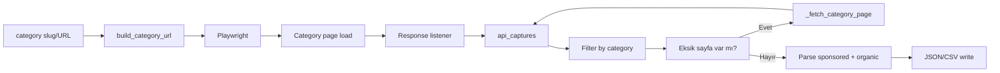

# Salesforce AppExchange Category Listing Scraper — Teknik Dokümantasyon

Bu belge `salesforce_category_listing.py` script'inin AppExchange kategori sayfasından (explore/business-needs?category=…) uygulama listesini **nasıl** çektiğini, API yakalama, sayfalama, sponsored/organic ayrımı ve çıktı şemasıyla birlikte adım adım açıklar. **Veri kaynağı:** Liste verisi **listings API**’sinden gelir (`category=` param); Playwright ile API yanıtları yakalanır veya doğrudan HTTP ile istek atılır (API-first). Mantık, keyword search ile aynı mimariyi izler; fark girişin kategori slug/URL olması ve parametrenin `category` (veya `businessNeed`) kullanılmasıdır.

---

## 1. Genel akış

Script, kategori sayfasını Playwright ile açar; sayfa yüklenirken arka planda yapılan API isteklerini dinler ve JSON yanıtlarını toplar. Yakalanan yanıtlar yalnızca **bu kategoriye ait** olanlarla filtrelenir (URL’de `category=` veya `businessNeed=` ve slug eşleşmesi). İstenen sayfa sayısı tarayıcıdan gelmemişse eksik sayfalar doğrudan HTTP ile aynı API’den `category=` parametresiyle çekilir. Toplanan yanıtlar parse edilerek **sponsored** ve **organic** olarak iki ayrı diziye ayrılır; her öğede sayfa numarası, listing tipi (Salesforce ID / UUID) ve reklam bilgisi tutulur. Sonuç JSON ve isteğe bağlı CSV olarak yazılır.



**Özet akış:**

1. Girdi (slug veya tam URL) `build_category_url` ile `(category_url, category_slug)` çiftine dönüştürülür.
2. Kategori URL’i Playwright ile açılır; scroll ve isteğe bağlı "Show more" tıklamaları yapılır. `appexchange.salesforce.com` / `api.appexchange.salesforce.com` kökenli 200 JSON yanıtları `api_captures` listesine eklenir.
3. `type=apps` olan ve **kategori slug’ı ile eşleşen** (URL’de `category=` veya `businessNeed=` ve slug) yanıtlardan hangi sayfa numaralarının (0, 1, 2, …) geldiği tespit edilir.
4. `--pages N` ile istenen sayfa sayısına göre eksik sayfalar için doğrudan `recommendations/v3/listings?type=apps&page=…&category=<slug>` API’sine GET atılır; yanıtlar `api_captures`’a eklenir.
5. Tüm yakalanan (ve kategoriye ait) yanıtlar sayfa numarasına göre sıralanıp parse edilir: sayfa 0’dan **featured** → sponsored, **listings** → organic; diğer sayfalardan sadece **listings** → organic.
6. `category_url`, `category`, `sponsored`, `organic` ile JSON yazılır; `--csv` verilmişse aynı veri CSV’e (type, position, page, category, …) yazılır.

**Playwright hatası durumunda:** Tarayıcı çökerse veya başka bir exception olursa script, doğrudan API ile sayfa 0 .. N-1’i `_fetch_category_page(category_slug, page)` ile çekmeyi dener; bu yanıtlar parse edilip yine sponsored/organic olarak yazılır. Böylece tarayıcı olmadan da sonuç alınabilir.

---

## 2. URL’ler ve sayfa yapısı

### 2.1 Kategori sayfası (UI)

- **URL formatı:** `https://appexchange.salesforce.com/explore/business-needs?category=<slug>`
- **Örnekler:** `https://appexchange.salesforce.com/explore/business-needs?category=marketing`, `...?category=customerService`
- Kullanıcı bu sayfada bir iş ihtiyacı (business need) kategorisine göre uygulamaları görür. Sonuçlar JavaScript ile yüklenir (SPA); ilk HTML’de tam liste yer almaz. **Asıl veri** aynı **listings API**’sinden (`category=` param) gelir; script API yanıtlarını yakalayıp parse eder (API-first). Sayfada app kartları, sponsored alanı ve "Show more" butonu bulunur.

### 2.2 Girdi kabul eden formatlar

| Girdi | Sonuç |
|-------|--------|
| Tam URL | `https://appexchange.salesforce.com/explore/business-needs?category=customerService` → slug `category` (veya `businessNeed`) query parametresinden parse edilir. |
| Slug | `customerService` → URL `.../explore/business-needs?category=customerService` üretilir. |
| Path | `/explore/business-needs?category=customerService` gibi path → base URL ile birleştirilir, slug path’ten çıkarılır. |

### 2.3 Backend API (listings)

- **Base URL:** `https://api.appexchange.salesforce.com/recommendations/v3/listings`
- Keyword arama ile **aynı endpoint**; parametre farkı:
  - `keyword=<keywords>` yerine **`category=<slug>`** kullanılır (bazı ortamlarda `businessNeed=<slug>` da görülebilir; script URL’de slug geçen tüm type=apps yanıtlarını kategori yanıtı kabul eder).
- **Query parametreleri:**
  - `type=apps`
  - `page` — Sayfa indeksi (0 tabanlı).
  - `pageSize=12`
  - `language=en`
  - `category=<slug>` — Kategori kodu (örn. `customerService`).
- **Sadece page=0 için ek parametre:** `sponsoredCount=4`

Örnek istek URL’i (ilk sayfa):

```
https://api.appexchange.salesforce.com/recommendations/v3/listings?type=apps&page=0&pageSize=12&language=en&sponsoredCount=4&category=customerService
```

### 2.4 Listing detay URL’i

- **Format:** `https://appexchange.salesforce.com/appxListingDetail?listingId=<id>`
- `<id>` hem **Salesforce ID** (örn. `a0N3A00000B5GNkEAN`) hem **UUID** (örn. `de2083cc-858b-4c71-946f-4cab33143629`) olabilir; keyword search ile aynı şekilde her iki tip için de aynı URL formatı kullanılır.

---

## 3. Neden Playwright + API capture?

- Kategori sayfası da bir **SPA**; sonuç listesi sunucudan gelen ilk HTML’de tam olarak yok. Liste, sayfa açıldıktan sonra JavaScript ile `api.appexchange.salesforce.com` (veya aynı origin’deki API) adresine yapılan isteklerle doldurulur.
- DOM’da sonuçlar keyword sayfasına benzer yapılarda (kartlar, tile’lar) olabilir; güvenilir ve tam veri (logo, rating, kategoriler, açıklama) **API yanıtlarından** gelir.
- **Güvenilir yöntem:** Playwright ile sayfayı açıp bir **response listener** ile tüm isteklere gelen yanıtları dinlemek. `appexchange.salesforce.com` ve `api.appexchange.salesforce.com` kökenli, 200 dönen, JSON body’li yanıtlar toplanır. Ana veri kaynağı bu **API yanıtları**dır.
- Toplanan yanıtlar içinden yalnızca **bu kategoriye ait** olanlar (URL’de slug veya payload’da kategori bilgisi) kullanılır; böylece başka kategoriler veya genel öneri istekleri karışmaz.

---

## 4. API yanıt yapısı

Kategori listesi API’si, keyword listesi ile **aynı yapıyı** kullanır. Tek bir listings yanıtı (JSON):

**Kök alanlar:**

- `totalCount` — Toplam sonuç sayısı (bilgi amaçlı).
- `listings` — **Array.** Bu sayfadaki organik uygulama listesi (sayfa başına genelde 12).
- `featured` — **Sadece page=0 yanıtında bulunur.** Sponsored uygulamaların listesi (örn. 3–4 öğe).

**Her bir listing/featured öğesinde kullanılan alanlar:**

| API alanı | Açıklama |
|-----------|----------|
| `oafId` | Benzersiz ID. **Salesforce ID** (`a0N` ile başlayan 15–18 karakter) veya **UUID** (örn. `de2083cc-858b-4c71-946f-4cab33143629`) olabilir. |
| `title` | Uygulama adı. |
| `description` | Uzun açıklama; script bunu kısaltıp `short_description` olarak yazar. |
| `listingCategories` | Kategori kodları dizisi (örn. `["customerService", "telephony"]`). |
| `logos` | Logo listesi. Her eleman: `mediaId` (URL), `logoType` (örn. "Logo", "Big Logo"). Script öncelikle "Logo" veya "Big Logo" seçer. |
| `averageRating` | Ortalama puan. |
| `reviewsAmount` | Yorum sayısı. |
| `sponsored` | Opsiyonel boolean; featured öğelerinde genelde `true`. |

Kategori isteklerinde `queryText` yerine bazen payload’da `category` veya benzeri bir alan bulunabilir; script URL ve gerekirse payload ile slug eşleşmesine göre filtreler.

---

## 5. Veri modeli: sponsored vs organic

### 5.1 Sponsored

- **Kaynak:** Sadece **page=0** API yanıtındaki `featured` dizisi.
- **Pozisyon:** Kendi içinde 1’den başlayan sıra (1, 2, 3, …).
- **Sayfa:** Her zaman `page: 1` (ilk kategori sayfasında görünürler).
- **Bayrak:** `is_sponsored: true`.

### 5.2 Organic

- **Kaynak:** Her sayfa (0, 1, 2, …) yanıtındaki `listings` dizisi.
- **Pozisyon:** Tüm organic sonuçlar tek listede birleştirilir; pozisyon 1’den başlar ve artarak devam eder.
- **Sayfa:** Hangi kategori sayfasında çıktığı 1 tabanlı: ilk sayfa → `page: 1`, ikinci → `page: 2`, vb.
- **Bayrak:** `featured`’dan gelmeyen veya API’de `sponsored: true` olmayan satırlarda `is_sponsored: false`; aynı uygulama hem featured hem listings’te varsa organic satırında `true` da olabilir.

### 5.3 Aynı uygulama hem sponsored hem organic’te

Keyword search’te olduğu gibi bir uygulama hem `featured` (sponsored) hem de `listings` (organic) içinde yer alabilir. Script iki listeyi **ayrı ayrı** tutar; arada deduplicate yapmaz. Aynı `listing_id` iki kez çıkar: biri `sponsored` dizisinde, biri `organic` dizisinde (kendi pozisyon ve `page` değerleriyle).

---

## 6. listing_id_type ve is_sponsored

- **listing_id_type:** Her sonuç öğesinde ID’nin tipi.
  - `"salesforce"`: `oafId`, `^[a0N][A-Za-z0-9]{14,18}$` ile eşleşiyorsa.
  - `"uuid"`: Diğer tüm durumlar (örn. standart UUID formatı).
- **is_sponsored:** Öğenin reklam (sponsored) olup olmadığı.
  - `true`: Öğe `featured` dizisinden geldiyse veya API’de `sponsored: true` ise.
  - `false`: Sadece organic listede yer alan ve reklam işareti taşımayan satırlar için.

---

## 7. Kategori yanıtlarının filtrelenmesi

Tarayıcı aynı oturumda birden fazla API isteği tetikleyebilir (farklı kategoriler, genel öneriler vb.). Script yalnızca **mevcut kategoriye ait** yanıtları kullanır:

- İstek URL’i `type=apps` içermeli.
- URL’de kategori slug’ı geçmeli: `category=<slug>` veya `businessNeed=<slug>` (büyük/küçük harf ve encoding farkları dikkate alınır). Veya payload’da `category` alanı slug ile eşleşmeli.
- Aynı sayfa numarası için birden fazla yanıt varsa bir tanesi (ör. ilk yakalanan) kullanılır.

Doğrudan API ile eksik sayfa çekilirken URL her zaman `category=<slug>` ile oluşturulur; Salesforce’un bu endpoint’te `businessNeed` kullandığı sürümlerde bile script şu an `category` parametresini kullanır (gerekirse `--debug-api` ile yakalanan URL’lere bakılarak parametre adı doğrulanabilir).

---

## 8. Pagination

- **Varsayılan:** Sadece ilk sayfa (API’de page=0).
- **`--pages N`:** En fazla N sayfa kullanılır (sayfa indeksleri 0 .. N-1). Örn. `--pages 3` → page=0, 1, 2.

**Tarayıcıdan gelen sayfalar:** Sayfa açıldıktan sonra scroll ve "Show more" tıklamaları yapılır; frontend ek sayfa istekleri atar (page=1, 2, …). Script, **kategoriye ait** yakalanan yanıtların URL’lerinden sayfa numarasını çıkarır (`_page_number_from_url`) ve stderr’e "Pages from browser: [0, 1]" benzeri yazar.

**Eksik sayfalar:** İstenen sayfa sayısına göre henüz yakalanmamış sayfa indeksi varsa, script bu sayfaları **doğrudan HTTP** ile alır: `_fetch_category_page(category_slug, page_num)`. Aynı API URL’i ve parametreleri (`type=apps`, `page`, `pageSize=12`, `language=en`, `category=<slug>`; page=0 için `sponsoredCount=4`) kullanılır; yanıt `api_captures`’a eklenir.

Her doğrudan API isteğinden sonra 0.3 saniye beklenir (rate limiting). Sayfa geçişi logları keyword search ile aynı formatta stderr’e yazılır.

---

## 9. Parse sırası ve sayfa sırası

- Tüm `api_captures` içinden **type=apps** ve **kategori slug eşleşen** yanıtlar filtrelenir; her URL’den sayfa numarası alınır.
- Sayfa numaralarına göre **artan sırada** işlenir: 0, 1, 2, …
- **Sayfa 0:** Önce `featured` dizisi sponsored olarak eklenir (position 1, 2, 3, …; page=1; is_sponsored=true). Ardından `listings` dizisi organic olarak eklenir (organic position 1, 2, …; page=1).
- **Sayfa 1, 2, …:** Sadece `listings` dizisi organic olarak eklenir; `page` değeri 2, 3, … (1 tabanlı) atanır.
- **Logo URL:** `logos` dizisinde önce `logoType` "Logo" veya "Big Logo" olan tercih edilir; yoksa ilk elemanın `mediaId`’si kullanılır.
- **Kısa açıklama:** `description` en fazla 300 karaktere kısaltılır; gerekirse sonuna "..." eklenir.

---

## 10. Çıktı şeması (JSON ve CSV)

### 10.1 JSON

Kök yapı:

| Alan | Tip | Açıklama |
|------|-----|----------|
| `category_url` | string | Açılan kategori sayfası URL’i. |
| `category` | string | Kategori slug (örn. `customerService`). |
| `sponsored` | array | Sponsored sonuç listesi. |
| `organic` | array | Organic sonuç listesi. |

Her bir **sponsored** veya **organic** öğesi:

| Alan | Tip | Açıklama |
|------|-----|----------|
| `position` | number | İlgili listede 1 tabanlı sıra. |
| `page` | number | Kategori sonuç sayfası (1 tabanlı). Sponsored için hep 1. |
| `listing_id` | string | oafId (Salesforce ID veya UUID). |
| `listing_id_type` | string | `"salesforce"` veya `"uuid"`. |
| `name` | string \| null | Uygulama adı. |
| `url` | string | Detay sayfası URL’i (appxListingDetail?listingId=...). |
| `logo_url` | string \| null | Tercih edilen logo görseli URL’i. |
| `average_rating` | number \| null | Ortalama puan. |
| `review_count` | number \| null | Yorum sayısı. |
| `short_description` | string \| null | Kısaltılmış açıklama (max 300 karakter). |
| `categories` | array | Kategori kodları. |
| `is_sponsored` | boolean | Reklam mı. |
| `category` | string | Kategori slug (tekrar). |
| `category_url` | string | Kategori sayfası URL’i (tekrar). |

### 10.2 CSV

- Tek tablo: önce tüm **sponsored** satırları, sonra tüm **organic** satırları.
- Ek kolon: **`type`** — `"sponsored"` veya `"organic"`.
- Diğer kolonlar: `position`, `page`, `listing_id`, `listing_id_type`, `name`, `url`, `logo_url`, `average_rating`, `review_count`, `short_description`, `categories`, `is_sponsored`, `category`, `category_url`.
- `categories` sütununda değerler virgülle ayrılmış tek string olarak yazılır.

---

## 11. Fallback (API yoksa)

API’den hiç **kategoriye ait type=apps** yanıt gelmezse (ör. ağ hatası, filtre sonucu boş), script **HTML fallback** kullanır:

- `parse_category_page(html, category_url)` çağrılır. BeautifulSoup ile sayfadaki `<a href="...listingId=...">` linkleri taranır; gerekirse HTML içinde `listingId=` geçen yerler regex ile bulunur. Hem Salesforce ID hem UUID pattern’i desteklenir.
- Bu yolla üretilen sonuçlar **sadece organic** listesine konur; sponsored boş kalır.
- Her öğeye `page: 1`, `listing_id_type` (ID pattern’den), `is_sponsored: false`, `category`, `category_url` atanır; logo, rating, açıklama, kategoriler gibi alanlar yoksa `null` / boş bırakılır.

**Playwright exception fallback:** Tarayıcı açılamazsa veya `page.content()` çağrısı exception fırlatırsa (örn. "Target crashed"), script exception’ı yakalar ve **doğrudan API** ile sayfa 0 .. N-1’i `_fetch_category_page` ile çeker. Bu yanıtlar parse edilip sponsored/organic üretilir; böylece tarayıcı olmadan da çalışır. Hiç sonuç gelmezse script hata kodu 1 ile çıkar.

---

## 12. Show more ve scroll

- Sayfa yüklendikten sonra belirli sayıda **scroll** turu yapılır (sayfa sayısına bağlı).
- Ardından **"Show more"** butonu/linki aranır (`button:has-text('Show more')`, `a:has-text('Show more')`, `[aria-label*='Show more']`). Bulunursa en fazla 8 kez tıklanır; her tıklamada kısa bekleme yapılır. Böylece infinite scroll veya buton ile yüklenen ek sayfalar tetiklenir ve API yanıtları yakalanır.
- Hem scroll hem Show more uygulandığı için farklı sayfa davranışlarında en az biri ek istek üretir.

---

## 13. CLI ve loglama

### 13.1 Argümanlar

| Argüman | Açıklama |
|---------|----------|
| `category` (positional) | Kategori slug (örn. `customerService`) veya tam kategori URL’i. |
| `--pages N` | Kaç sayfa sonuç alınacağı (varsayılan: 1). |
| `-o`, `--output` | JSON çıktı dosyası yolu (varsayılan: `files/category-<slug>.json`). |
| `--csv` | CSV dosyası yolu; verilirse CSV de yazılır. |
| `--save-html PATH` | İndirilen kategori sayfası HTML’ini bu dosyaya yazar (debug). Playwright başarısız olup direct API kullanıldıysa HTML boş olacağı için dosya yazılmaz. |
| `--debug-api PATH` | Yakalanan API yanıtlarını (URL + payload) bu dosyaya JSON olarak yazar (debug). |

### 13.2 Sayfa geçişi logları (stderr)

- **"Pages from browser: [0, 1]"** — Tarayıcıdan gelen kategoriye ait type=apps yanıtlardaki sayfa indeksleri (0 tabanlı).
- **"Fetching page K (API)..."** — Eksik K. sayfa (1 tabanlı) doğrudan API’den isteniyor.
- **"Fetched page K."** — İstek başarılı.
- **"Failed to fetch page K."** — İstek başarısız.
- **"Using pages: [1, 2, 3]"** — Sonuçta kullanılan sayfalar (1 tabanlı).
- **"Playwright failed: …"** / **"Falling back to direct API fetch..."** — Tarayıcı hatası ve direct API fallback.
- **"Found X sponsored, Y organic (Z total) for category: <slug>"** — Özet (stderr).

Stdout’a sadece "Wrote …" mesajları yazılır; böylece pipe ile kullanımda karışıklık olmaz.

---

## 14. Bilinen sınırlamalar / notlar

- **Consultant’lar dahil değil:** Sadece `type=apps` yanıtları işlenir.
- **Rate limiting:** Doğrudan API isteği sonrası 0.3 saniye beklenir.
- **Sıra:** Featured ve listings sırası API’nin döndürdüğü sıraya bağlıdır; tarayıcıda görünen sıra bire bir korunur.
- **Kategori parametresi:** Doğrudan isteklerde şu an `category=<slug>` kullanılır; Salesforce’un `businessNeed` kullandığı versiyonlarda ilk çalıştırmada `--debug-api` ile gerçek istek URL’lerine bakılıp gerekirse parametre adı güncellenebilir.
- **Playwright bağımlılığı:** Tam akış için Playwright gerekir; kurulum: `pip install playwright && playwright install chromium`. Tarayıcı çalışmazsa script otomatik olarak sadece direct API ile devam eder.

### 14.1 İlgili script: Keyword ranking (salesforce_keyword_ranking.py)

Keyword aramada **toplu sıralama** (bir listing_id’nin birçok keyword’teki sırasını bulma) için ayrı bir script kullanılır: `salesforce_keyword_ranking.py`. Bu script **Playwright kullanmaz**; yalnızca direct API ile sayfa sayfa çeker, hedef uygulama bulununca erken çıkar ve böylece tarayıcı çökmesi ("Target crashed") riski olmaz. Hata durumunda 3 retry ve rastgele bekleme uygular. Kategori listing script'i (bu belge) ise tam liste çekmek için Playwright + API kullanmaya devam eder; kategori için benzer bir "ranking batch" script'i yoktur. Detay için `KEYWORD_SEARCH_SCRAPING.md` bölüm 13’e bakın.

İlgili dokümanlar: `KEYWORD_SEARCH_SCRAPING.md` (aynı API ve parse mantığı; bölüm 13: keyword ranking batch), `SALESFORCE_DATA_STRUCTURE.md` (veri yapısı referansı).
