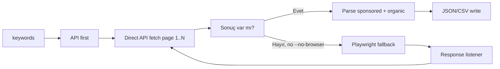

# Salesforce AppExchange Keyword Search Scraper — Teknik Dokümantasyon

Bu belge `salesforce_keyword_search.py` script'inin AppExchange anahtar kelime arama sayfasından sonuçları **nasıl** çektiğini, API yakalama, sayfalama, sponsored/organic ayrımı ve çıktı şemasıyla birlikte adım adım açıklar.

---

## 1. Genel akış

Varsayılan: Veri **önce doğrudan API** ile alınır (tarayıcı açılmaz); sayfalar arasında 0,5–1,5 sn rastgele beklenir. API boş dönerse ve `--no-browser` yoksa **Playwright fallback** ile arama sayfası açılır, arka plandaki API yanıtları dinlenir. Toplanan yanıtlar parse edilerek **sponsored** ve **organic** olarak iki ayrı diziye ayrılır; her öğede sayfa numarası (1 tabanlı), listing tipi ve reklam bilgisi tutulur. Sonuç JSON ve isteğe bağlı CSV olarak yazılır.



**Özet akış:**

1. Önce **direct API** ile `recommendations/v3/listings` çağrılır (`page=1`, 2, … N; 1 tabanlı). Sayfalar arasında 0,5–1,5 sn rastgele beklenir.
2. API sonuç döndürürse yanıtlar parse edilir. API boş dönerse ve `--no-browser` yoksa arama sayfası Playwright ile açılır; gelen API yanıtları dinlenir, eksik sayfalar yine direct API ile doldurulabilir.
3. `type=apps` ve keyword eşleşen yanıtlardan sayfa numaraları (1, 2, …) tespit edilir.
4. Tüm yanıtlar sayfa numarasına göre sıralanıp parse edilir: **ilk sayfa** (en küçük numara) → **featured** sponsored, **listings** organic; diğer sayfalar → sadece **listings** organic.
5. `keywords`, `sponsored`, `organic` ile JSON yazılır; `--csv` verilmişse aynı veri CSV'e yazılır.

---

## 2. URL’ler ve sayfa yapısı

### 2.1 Arama sayfası (UI)

- **URL:** `https://appexchange.salesforce.com/appxSearchKeywordResults?keywords=<keywords>`
- **Örnek:** `https://appexchange.salesforce.com/appxSearchKeywordResults?keywords=form`
- Kullanıcı bu sayfada anahtar kelime arar; sonuçlar JavaScript ile yüklenir (SPA). İlk HTML’de sonuç listesi tam olarak yer almaz. **Asıl veri** aynı sayfanın çağırdığı **listings API**’sinden gelir; script bu API yanıtlarını yakalayıp parse eder (API-first).

### 2.2 Backend API (listings)

- **Base URL:** `https://api.appexchange.salesforce.com/recommendations/v3/listings`
- **Query parametreleri:**
  - `type=apps` — Sadece uygulama listelemesi (consultant değil).
  - `page` — **1 tabanlı** sayfa numarası. 1 = ilk sayfa, 2 = ikinci sayfa, …
  - `pageSize=12` — Sayfa başına sonuç (ör. 12).
  - `language=en`
  - `keyword=<keywords>` — Arama terimi.
- **Sadece ilk sayfa (page=1) için ek parametre:** `sponsoredCount=4` (ilk sayfada kaç sponsored slot olduğu).

Örnek istek URL’i (ilk sayfa):

```
https://api.appexchange.salesforce.com/recommendations/v3/listings?type=apps&page=1&pageSize=12&language=en&sponsoredCount=4&keyword=form
```

### 2.3 Listing detay URL’i

- **Format:** `https://appexchange.salesforce.com/appxListingDetail?listingId=<id>`
- `<id>` hem **Salesforce ID** (örn. `a0N3A00000B5GNkEAN`) hem **UUID** (örn. `de2083cc-858b-4c71-946f-4cab33143629`) olabilir; aynı URL formatı her iki tip için de geçerlidir.

---

## 3. API first, Playwright fallback

- **Varsayılan:** Veri **doğrudan API** ile alınır; tarayıcı açılmaz; sayfalar arasında rastgele 0,5–1,5 sn beklenir.
- **Fallback:** API boş dönerse ve `--no-browser` verilmemişse script Playwright ile arama sayfasını açar; sayfa yüklenirken arka plandaki API isteklerini dinler ve JSON yanıtlarını toplar. Arama sayfası bir **SPA** olduğu için asıl veri bu API yanıtlarındadır; DOM kazıma güvenilir değildir.
- **`--no-browser`:** Sadece direct API kullanılır; API boş olsa bile Playwright devreye girmez.

---

## 4. API yanıt yapısı

Tek bir listings API yanıtı (JSON) kabaca şu yapıdadır:

**Kök alanlar:**

- `queryText` — Gönderilen arama terimi.
- `totalCount` — Toplam sonuç sayısı (bilgi amaçlı).
- `listings` — **Array.** Bu sayfadaki organik uygulama listesi (ilk sayfada genelde 12, diğer sayfalarda da 12’şer).
- `featured` — **Sadece ilk sayfa (page=1) yanıtında bulunur.** Sponsored (reklam) uygulamaların listesi (ör. 3 öğe).

**Her bir listing/featured öğesinde kullanılan alanlar:**

| API alanı | Açıklama |
|-----------|----------|
| `oafId` | Benzersiz ID. **Salesforce ID** (`a0N` ile başlayan 15–18 karakter) veya **UUID** (örn. `de2083cc-858b-4c71-946f-4cab33143629`) olabilir. |
| `title` | Uygulama adı. |
| `description` | Uzun açıklama; script bunu kısaltıp `short_description` olarak yazar. |
| `listingCategories` | Kategori kodları dizisi (örn. `["surveys", "websites"]`). |
| `logos` | Logo listesi. Her eleman: `mediaId` (URL), `logoType` (örn. "Logo", "Big Logo"). Script öncelikle "Logo" veya "Big Logo" seçer. |
| `averageRating` | Ortalama puan. |
| `reviewsAmount` | Yorum sayısı. |
| `sponsored` | Opsiyonel boolean; featured öğelerinde genelde `true`. |

**oafId tipleri:** Hem Salesforce ID hem UUID aynı detay URL’i ile açılır: `appxListingDetail?listingId=<oafId>`. Script, ID’nin hangi tipte olduğunu `listing_id_type` alanında (`"salesforce"` / `"uuid"`) raporlar.

---

## 5. Veri modeli: sponsored vs organic

### 5.1 Sponsored

- **Kaynak:** Sadece **ilk sayfa (page=1)** API yanıtındaki `featured` dizisi.
- **Pozisyon:** Kendi içinde 1’den başlayan sıra (1, 2, 3, …).
- **Sayfa:** Her zaman `page: 1` (ilk arama sayfasında görünürler).
- **Bayrak:** `is_sponsored: true`.

### 5.2 Organic

- **Kaynak:** Her sayfa (1, 2, …) yanıtındaki `listings` dizisi.
- **Pozisyon:** Tüm organic sonuçlar tek listede birleştirilir; pozisyon 1’den başlar ve artarak devam eder (sayfa geçişlerinde sıra korunur).
- **Sayfa:** Hangi arama sayfasında çıktığı 1 tabanlı: ilk sayfa → `page: 1`, ikinci → `page: 2`, vb.
- **Bayrak:** `featured`’dan gelmeyen veya API’de `sponsored: true` olmayan satırlarda `is_sponsored: false`; aynı uygulama hem featured hem listings’te varsa organic satırında `true` da olabilir.

### 5.3 Aynı uygulama hem sponsored hem organic’te

Bir uygulama hem `featured` (sponsored) hem de aynı veya başka bir sayfadaki `listings` (organic) içinde yer alabilir. Script bu iki listeyi **ayrı ayrı** tutar; arada deduplicate yapmaz. Aynı `listing_id` iki kez çıkar: biri `sponsored` dizisinde (sponsored pozisyonu ve `page: 1`), biri `organic` dizisinde (organic pozisyonu ve ilgili `page` değeriyle).

---

## 6. listing_id_type ve is_sponsored

- **listing_id_type:** Her sonuç öğesinde ID’nin tipi.
  - `"salesforce"`: `oafId`, `^[a0N][A-Za-z0-9]{14,18}$` ile eşleşiyorsa.
  - `"uuid"`: Diğer tüm durumlar (örn. standart UUID formatı).
- **is_sponsored:** Öğenin reklam (sponsored) olup olmadığı.
  - `true`: Öğe `featured` dizisinden geldiyse veya API’de `sponsored: true` ise.
  - `false`: Sadece organic listede yer alan ve reklam işareti taşımayan satırlar için.

---

## 7. Pagination

- **Varsayılan:** 1 sayfa. **API sayfa numarası 1 tabanlıdır** (1 = ilk sayfa, 2 = ikinci, …).
- **`--pages N`:** En fazla N sayfa çekilir. API'ye `page=1`, `page=2`, … `page=N` ile istek atılır.

**API-first modda:** Sayfalar sırayla direct API ile çekilir; **sayfalar arasında rastgele 0,5–1,5 saniye** beklenir (`SLEEP_BETWEEN_PAGES_MIN`, `SLEEP_BETWEEN_PAGES_MAX`). **Playwright fallback:** Tarayıcıdan gelen yanıtların URL'lerinden sayfa numarası çıkarılır; eksik sayfalar yine direct API ile doldurulabilir.

---

## 8. Parse sırası ve sayfa sırası

- Tüm `api_captures` içinden **type=apps** ve **keyword** eşleşen yanıtlar filtrelenir; her URL’den sayfa numarası alınır. Aynı sayfa numarası birden fazla yanıtta varsa bir tanesi (ör. ilk) kullanılır.
- Sayfa numaralarına göre **artan sırada** işlenir (1, 2, 3, …).
- **İlk sayfa** (en küçük sayfa numarası): Önce `featured` dizisi tek tek sponsored öğe olarak eklenir (position 1, 2, 3, …; page=1; is_sponsored=true). Ardından `listings` dizisi organic olarak eklenir (organic position 1, 2, …; page=1).
- **Diğer sayfalar:** Sadece `listings` dizisi organic olarak eklenir; `page` değeri 2, 3, … (1 tabanlı) atanır.
- **Logo URL:** `logos` dizisinde önce `logoType` "Logo" veya "Big Logo" olan tercih edilir; yoksa ilk elemanın `mediaId`’si kullanılır.
- **Kısa açıklama:** `description` en fazla 300 karaktere kısaltılır; gerekirse sonuna "..." eklenir.

---

## 9. Çıktı şeması (JSON ve CSV)

### 9.1 JSON

Kök yapı:

| Alan | Tip | Açıklama |
|------|-----|----------|
| `keywords` | string | Aranan anahtar kelime. |
| `sponsored` | array | Sponsored sonuç listesi (yukarıdaki kurallara göre). |
| `organic` | array | Organic sonuç listesi. |

Her bir **sponsored** veya **organic** öğesi:

| Alan | Tip | Açıklama |
|------|-----|----------|
| `position` | number | İlgili listede 1 tabanlı sıra. |
| `page` | number | Arama sonuç sayfası (1 tabanlı). Sponsored için hep 1. |
| `listing_id` | string | oafId (Salesforce ID veya UUID). |
| `listing_id_type` | string | `"salesforce"` veya `"uuid"`. |
| `name` | string \| null | Uygulama adı. |
| `url` | string | Detay sayfası URL’i (appxListingDetail?listingId=...). |
| `logo_url` | string \| null | Tercih edilen logo görseli URL’i. |
| `average_rating` | number \| null | Ortalama puan. |
| `review_count` | number \| null | Yorum sayısı. |
| `short_description` | string \| null | Kısaltılmış açıklama (max 300 karakter). |
| `categories` | array | Kategori kodları. |
| `is_sponsored` | boolean | Reklam mı. |
| `keywords` | string | Aranan anahtar kelime (tekrar). |

### 9.2 CSV

- Tek tablo: önce tüm **sponsored** satırları, sonra tüm **organic** satırları.
- Ek kolon: **`type`** — `"sponsored"` veya `"organic"`.
- Diğer kolonlar: `position`, `page`, `listing_id`, `listing_id_type`, `name`, `url`, `logo_url`, `average_rating`, `review_count`, `short_description`, `categories`, `is_sponsored`, `keywords`.
- `categories` sütununda değerler virgülle ayrılmış tek string olarak yazılır.

---

## 10. Fallback (API yoksa)

API’den hiç **type=apps** + keyword eşleşen yanıt gelmezse (ör. ağ hatası, sayfa değişikliği), script **HTML fallback** kullanır:

- `parse_search_results(html, keywords)` çağrılır. BeautifulSoup ile sayfadaki `<a href="...listingId=...">` linkleri ve gerekirse HTML içindeki regex ile `listingId=` geçen yerler taranır.
- Bu yolla üretilen sonuçlar **sadece organic** listesine konur; sponsored boş kalır.
- Her öğeye `page: 1`, `listing_id_type` (ID pattern’den), `is_sponsored: false` atanır; logo, rating, açıklama, kategoriler gibi alanlar yoksa `null` / boş bırakılır.

---

## 11. CLI ve loglama

### 11.1 Argümanlar

| Argüman | Açıklama |
|---------|----------|
| `keywords` (positional) | Aranacak anahtar kelime (örn. `form`, `integration`). |
| `--pages N` | Kaç sayfa sonuç alınacağı (varsayılan: 1). |
| `-o`, `--output` | JSON çıktı dosyası yolu (varsayılan: `files/keyword-<keywords>.json`). |
| `--csv` | CSV dosyası yolu; verilirse CSV de yazılır. |
| `--no-browser` | Sadece direct API; API boş dönerse Playwright fallback yapma. |
| `--save-html PATH` | İndirilen arama sayfası HTML’ini bu dosyaya yazar (debug; Playwright kullanıldığında). |
| `--debug-api PATH` | Yakalanan API yanıtlarını (URL + payload) bu dosyaya JSON olarak yazar (debug). |

### 11.2 Sayfa geçişi logları (stderr)

- **"Fetching page K/N (API)..."** — K. sayfa (1 tabanlı) doğrudan API'den isteniyor (varsayılan API-first mod).
- **"API returned no results, trying Playwright..."** — API boş döndü, Playwright fallback devreye girdi (`--no-browser` yoksa).
- **"Pages from browser: [1, 2]"** — Playwright kullanıldığında tarayıcıdan gelen sayfa numaraları.
- **"Using pages: [1, 2, 3]"** — Sonuçta kullanılan sayfalar (1 tabanlı).

Normal çıktı (örn. "Found 3 sponsored, 60 organic (63 total)...") da stderr’e yazılır; böylece stdout sadece pipe’lanan çıktıya ayrılabilir.

---

## 12. Bilinen sınırlamalar / notlar

- **Consultant’lar dahil değil:** Sadece `type=apps` yanıtları işlenir; consultant araması veya consultant listesi çıktıya eklenmez.
- **Rate limiting:** API-first modda sayfalar arasında **rastgele 0,5–1,5 saniye** beklenir (`SLEEP_BETWEEN_PAGES_MIN`, `SLEEP_BETWEEN_PAGES_MAX`). API sayfa numarası 1-based (page=1 ilk sayfa); ilk sayfa sonuçları eksik kalmaz.
- **Sıra:** Featured ve listings sırası API’nin döndürdüğü sıraya bağlıdır; tarayıcıda görünen sıra bire bir korunur.
- **İlk sayfa featured sırası:** Bazen API’deki featured sırası ile sitede görünen sponsor sırası farklı olabilir; script API sırasını kullanır.

Detaylı veri yapısı referansı için `SALESFORCE_DATA_STRUCTURE.md` içindeki "Keyword search results" bölümüne bakılabilir.

---

## 13. Keyword ranking batch script (salesforce_keyword_ranking.py)

Aynı API ve parse mantığını kullanan **toplu sıralama** script'i: bir dosyadaki her keyword için hedef bir uygulamanın (listing_id) arama sonuçlarındaki **sayfa ve overall sırasını** bulur. Tek fark: **Playwright kullanmaz**, yalnızca doğrudan HTTP ile listings API'sini çağırır. Böylece tarayıcı çökmesi ("Page.evaluate: Target crashed") riski olmaz.

### 13.1 Neden sadece direct API?

- Playwright ile sayfa açıldığında bazen "Target crashed" hatası oluşur; özellikle çok sayıda keyword sırayla işlenirken tekrarlayabilir.
- Ranking script'inin ihtiyacı sadece sonuç listesindeki sıra bilgisi olduğu için aynı veri **direct API** (`_fetch_listings_page`) ile alınabilir. Tarayıcı açılmadığı için çökme olmaz.

### 13.2 Akış

1. Keyword listesi dosyadan okunur (varsayılan: `files/salesforce_keywords.txt`), sıra korunur.
2. Her keyword için sayfalar **sırayla** çekilir: önce ilk sayfa (API'de page=1), parse edilir, hedef listing_id aranır; **bulunduysa kalan sayfalar istenmez (erken çıkış)**. Bulunamazsa 2. sayfa, 3. sayfa, … en fazla 5 sayfaya kadar devam edilir.
3. Parse için `salesforce_keyword_search._parse_apps_response_paginated` kullanılır; sponsored/organic ve overall rank aynı şekilde hesaplanır.
4. Sonuçlar CSV (ve isteğe bağlı JSON) olarak yazılır; **satır sırası dosyadaki keyword sırasıyla aynıdır**. Bulunamayan keyword'ler de bir satır alır (`found: false`).

### 13.3 Hata ve retry

- Bir sayfa isteği başarısız olursa (API None dönerse) **en fazla 3 deneme** yapılır.
- Denemeler arasında **rastgele 5–15 saniye** beklenir (log: "Page N fetch failed (attempt 1/3), retrying in X.Xs...").
- 3 denemeden sonra hâlâ başarısızsa o keyword için satır `error` alanı ile yazılır, script sonraki keyword'e geçer.

### 13.4 Rastgele bekleme (rate limiting ve güvenilirlik)

- **Keyword'ler arası:** Rastgele 2–5 saniye (her keyword'ten sonra, ilki hariç).
- **Sayfalar arası:** Rastgele 0,3–0,8 saniye (hedef bulunup erken çıkılana kadar sayfa sayfa çekerken).
- **Retry öncesi:** 5–15 saniye (yukarıda belirtildiği gibi).

### 13.5 Çıktı ve CLI

- **CSV kolonları:** `keyword`, `listing_id`, `found`, `overall_rank`, `page`, `sponsored_position`, `organic_position`, `error`.
- **Hedef uygulama:** Varsayılan `--listing-id a0N4V00000JTeWyUAL`; CLI ile değiştirilebilir.
- **Argümanlar:** `--keywords-file` (varsayılan: `files/salesforce_keywords.txt`), `--listing-id`, `-o` / `--output` (CSV), `--json` (isteğe bağlı JSON).

### 13.6 Loglama (stderr)

- Başlangıç: "Processing N keywords (direct API, max 5 pages, early exit when target found)."
- Her keyword: "[K/N] keyword: …", "Starting keyword: '…'", "Fetching page 1/5 (API)...", "Target found (overall_rank=X, page=Y), stopping after page Z.", "Completed keyword: '…' (found=…)".
- Bekleme: "Sleeping X.XXs before next keyword/page...".
- Hata/retry: "Page N fetch failed (attempt X/3), retrying in X.Xs...", "Page N fetch failed after 3 attempts."
- Özet: "Found in X/N keywords."
