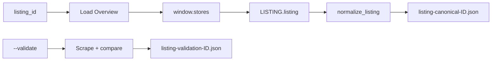

# Listing Canonical (API-style) — Dokümantasyon

Bu belge `salesforce_listing_canonical.py` script'inin ürettiği **canonical** JSON çıktısını ve veri kaynağını açıklar. Amaç: API'den gelen yapıya yakın isim ve yapı kullanmak, gereksiz alanları atmak; karşılaştırma ve ilerideki app marketplace aracı için uygun bir şema sunmak.

---

## 1. Veri kaynağı ve akış

- **Kaynak:** Sadece **API** — sayfadaki `window.stores.LISTING.listing` objesi. Scrape **normalde kullanılmaz**.
- **Scrape:** Yalnızca `--validate` ile ilk etapta "eksik veri kaldı mı?" kontrolü için; Overview ve More Details bölümleri API ile karşılaştırılır, rapor yazılır.
- **Reviews:** Bu script Reviews sekmesine gitmez. Çıktıda sadece API'deki **reviewsSummary** (reviewCount, averageRating) vardır; tekil review listesi ayrı script ile alınır.

---

## 2. Çıktı dosyaları

| Dosya | Açıklama |
|-------|----------|
| `files/listing-canonical-<listing_id>.json` | Canonical JSON (varsayılan; `-o` ile değiştirilebilir). |
| `files/listing-validation-<listing_id>.json` | Sadece `--validate` ile: API vs scrape karşılaştırma raporu. |
| `-api.json` (veya `--debug-api PATH`) | Ham `window.stores` (tüm store objesi). |

---

## 3. Canonical şema (tutulan alanlar)

API isimleri (camelCase) korunur; tekrarlar ve internal key'ler atılır.

### 3.1 Kimlik ve temel

| Alan | Kaynak | Açıklama |
|------|--------|----------|
| `listingId` | `tzId` / `external_id` / `oafId` | Tek ID. |
| `id` | `listing.id` | UUID. |
| `appExchangeId` | `listing.appExchangeId` | AppExchange kayıt ID. |
| `name` | `listing.name` | Uygulama adı. |
| `title` | `listing.title` | Kısa başlık. |
| `description` | `listing.description` | Kısa açıklama. |
| `fullDescription` | `listing.fullDescription` | Uzun açıklama. |
| `technology` | `listing.technology` | |

### 3.2 publisher

`listing.publisher` objesinden: `name`, `email`, `website`, `description`, `employees`, `yearFounded`, `location` (hQLocation), `country`. Internal id'ler ve plugins atılır.

### 3.3 extension

`listing.extensions[]` içinden `extensionType === "listing/extensions/force/listings/Listing"` olan extension'ın `data` objesi. Tutulan alanlar:

- `supportedIndustries`, `productsRequired`, `productsSupported`, `editions`
- `highlights`, `publishedDate`, `recordType`, `languages`, `targetUserPersona`, `listingCategories`

### 3.4 solution

`listing.solution.solution`: `manifest` (hasLWC, tabsCount, objectsCount, applicationsCount, globalComponentsCount, cmtyBuilderComponentsCount, isCommunityBuilder, isLightningAppBuilder, appBuilderComponentsCount), `latestVersionDate`, `packageId`, `namespacePrefix`, `packageCategory`, `createdDate`, `lastModifiedDate`. (`version` ve `securityReview` çıktıda yok; atılır.)

### 3.5 pricing

`price_model_type`; `model.plans[]` sadeleştirilmiş: `plan_name`, `price`, `currency_code`, `units`, `frequency`, `trial_days`. `model.user_limitations`, `additional_details`, `display_plan_names`, `discounts_offered` tutulur. Plan içindeki `id`, `index`, `active`, `source_record_type` atılır.

### 3.6 reviewsSummary

Sadece `reviewCount`, `averageRating`. `id`, `listing`, `external_id` atılır. Tekil `reviews[]` bu script'te yok.

### 3.7 businessNeeds

`listing.businessNeeds` — needKey → categories yapısı olduğu gibi.

### 3.8 plugins

Normalize edilmiş yapı: `videos`, `resources`, `carousel`, `logos`. Demo/Content → videos ve resources (url, type, title/caption); Carousel → carousel (url, caption, altText); LogoSet → logos (url, logoType). `external_id`, `position`, `icon`, `shouldDownload` gibi alanlar atılır.

---

## 4. Atılan / sadeleştirilen

- `public` (listing)
- Extension: `licenseAgreement`, `achApplicationFee`, `sepaApplicationFee`, `systemRequirements`, `programmingLanguages`, `isFedrampCertified`, `isSalesforceShield`, `isLightningComponent`, `isAccessibleSolution`, `isDiverseOwnedBusiness`, `isSalesforce1Mobile`
- Solution: `version` (versionName, majorVersion, minorVersion, patchVersion, isManaged, isReleased), `securityReview` (approvalDate, lastApprovedVersion)
- `LISTING.loadingStatus`, `deleted`, `partnerLookup`
- LeadTrialInformation campaign id'leri (demoCampaignID, trialCampaignID, installCampaignID, vb.)
- `FEATURE_FLAGS` (tüm store'dan)
- Plugin item'larda aşırı `external_id`, `position`
- Çift representation: `listing/plugins/LogoSet` gibi flat key'ler; tek kaynak `plugins` array'inden normalize edilir.

---

## 5. Argümanlar

| Argüman | Açıklama |
|---------|----------|
| `listing_id` | Zorunlu. Örn. `a0N4V00000JTeWyUAL`. |
| `-o`, `--output` | Çıktı JSON yolu. Varsayılan: `files/listing-canonical-<listing_id>.json`. |
| `--no-browser` | Sadece requests; `window.stores` olmaz, veri sınırlı (genelde listing yok). |
| `--validate` | İlk etapta: Overview + More Details scrape, API ile karşılaştırma, `listing-validation-<id>.json` raporu. |
| `--debug-api` [PATH] | Ham `window.stores`'u dosyaya yazar. Path verilmezse çıktı yolunun `-api.json` soneki. |

---

## 6. App detail ile fark

| | salesforce_app_detail.py | salesforce_listing_canonical.py |
|---|---------------------------|----------------------------------|
| Çıktı adları | Human-friendly (örn. `provider_details`, `pricing_plans`, `compatible_with`) | API-style (camelCase: `publisher`, `pricing.model.plans`, `extension.productsSupported`) |
| Yapı | Düz, tek seviye alanlar | extension / solution / pricing.model ayrımı |
| Reviews | Sadece JSON-LD/stores'tan aggregate | Sadece `reviewsSummary` (reviewCount, averageRating) |
| Amaç | Genel kullanım, raporlama | Karşılaştırma, DB/marketplace şeması, ilerideki araç |

Her iki çıktı da aynı sayfadan (`appxListingDetail?listingId=...`) üretilir; farklı dosya adlarıyla yan yana karşılaştırılabilir.
